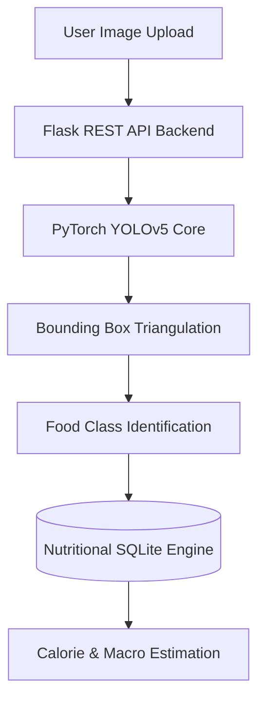

# 🍱 NutriScan-AI — Indian Food Recognition & Calorie Estimation

[]()
[]()
[]()

> **"NutriScan-AI is a high-performance computer vision application designed to identify Indian food dishes from images and provide instant nutritional calorie estimations. Houses a YOLOv5 model and an interactive React web dashboard."**

---

## ⚡ The Recruiter Takeaway (Why This Matters)
1. **Custom Object Detection**: Uses a PyTorch YOLOv5 architecture mapped with regional Indian food dataset weights to detect multiple dishes in a single frame.
2. **Dynamic UI/UX**: Built with React (Vite), Framer Motion, and Tailwind CSS v4, featuring high-fidelity glassmorphic charts and calorie progress bars.
3. **Decoupled Architecture**: Fully containerized stack with modular RESTful APIs and cross-origin security rules.

---

## 🏗️ Computer Vision Pipeline



---

## 🛠️ Quick Launch

### 1. Requirements
* Install [Python 3.12+](https://www.python.org/) and [Node.js](https://nodejs.org/).

### 2. Startup Command
```bash
git clone https://github.com/kalyan-1845/NutriScan-AI.git
cd NutriScan-AI

# Start Vision API Server
pip install -r requirements.txt
python main.py --port 8080
```
*To launch the frontend web client, navigate to the `frontend/` directory and execute `npm run dev`.*
